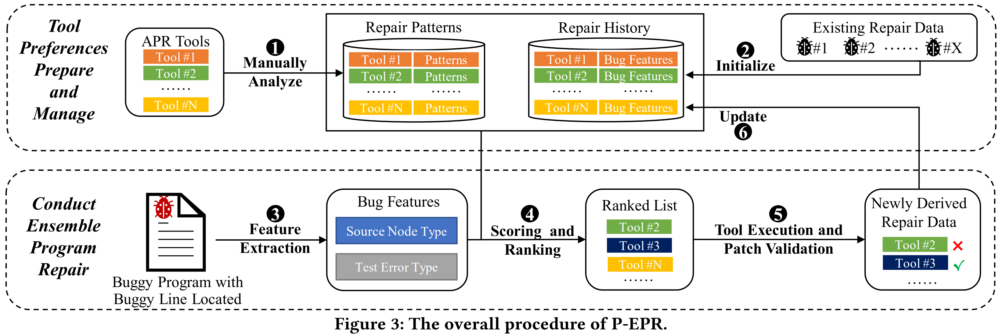

# Practical Program Repair via Preference-based Ensemble Strategy

This repository contains artifacts of the paper.

## Structure
```yaml
├── BugFeaturer
│   └── :   source codes of P-EPR framework 
├── Configs
│   └── :   information for configuring APR tools (i.e., manually summarized repair patterns of different tools and the repair history)
├── Figs
│   └── :   figure of P-EPR framework
├── E-APR-Replication
│   └── :   our implementation of the E-APR strategy 
├── Experiment_Log
│   ├── P-EPR-log:       experiment results of P-EPR
│   └── E-APR-log:       patches generated by TranplantFix for Defects4J v2.0 bugs
├── Measurement_Code
│   └── :  source codes for computing experimental metrics
├── README.md

```

## The P-EPR Framework


We propose a Preference-based Ensemble Program Repair framework (**P-EPR**),
which aims to efficiently assemble existing diverse APR tools. The term `preference' refers to the features of bugs that can be more readily addressed by a given tool than others, i.e., the tool has a higher probability to generate a correct fix for that kind of bug. 
For a given bug, **P-EPR** ranks available tools by quantifying each tool's preference score based on computed mappings of tools' preferences.

## Running P-EPR
### Step 1. Configuring Available APR tools 

### Step 2. Ranks APR tools for the input bug (a buggy class file along with the suspicious line id)