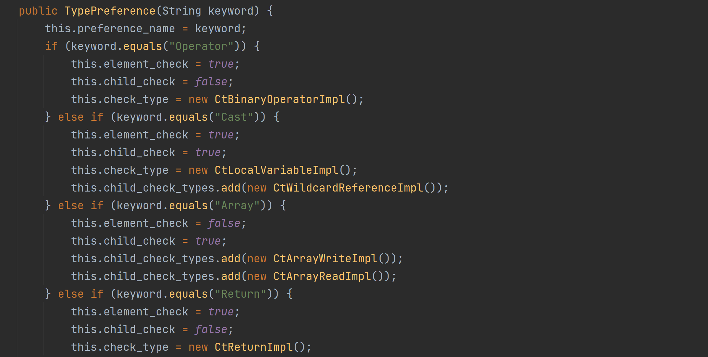
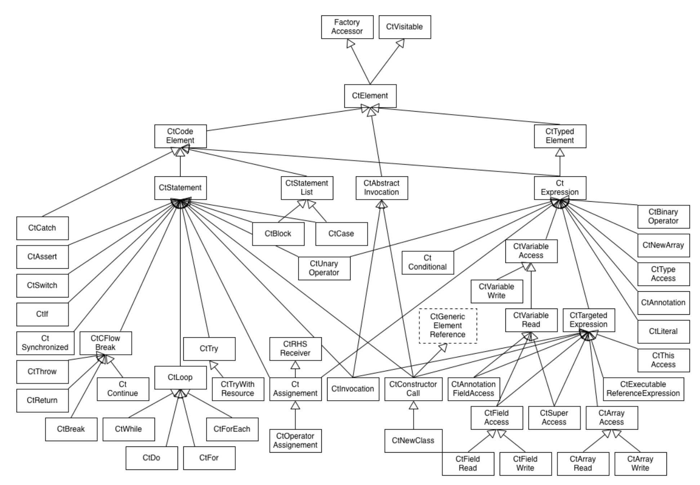
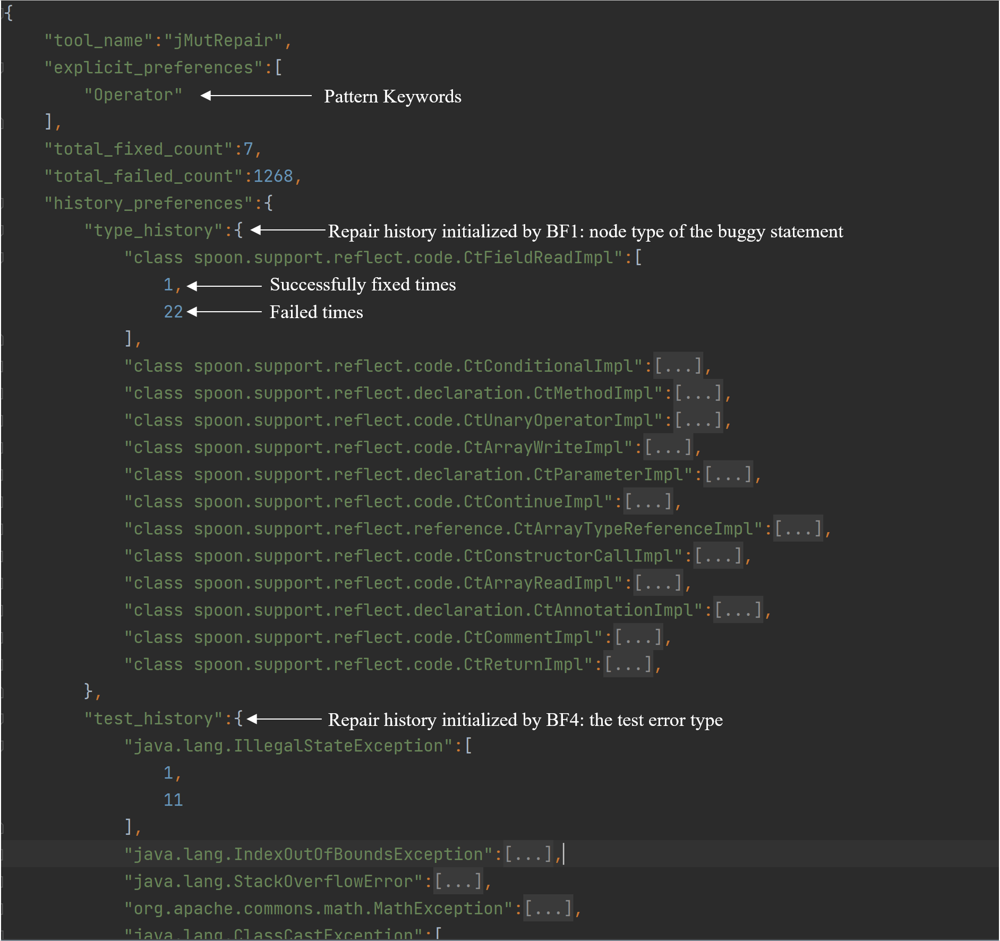

# Practical Program Repair via Preference-based Ensemble Strategy

This repository contains artifacts of the ICSE2024 early paper "Practical Program Repair via Preference-based Ensemble Strategy".

## Structure
```yaml
├── BugFeaturer
│   └── :   source codes of P-EPR framework 
├── Configs
│   └── :   information for configuring APR tools (i.e., manually summarized repair patterns of different tools and the repair history)
├── Figs
│   └── :   figure of P-EPR framework
├── E-APR-Replication
│   └── :   our implementation of the E-APR strategy 
├── Experiment_Log
│   ├── P-EPR-log:       experiment results of P-EPR
│   └── E-APR-log:       patches generated by TranplantFix for Defects4J v2.0 bugs
├── Measurement_Code
│   └── :  source codes for computing experimental metrics
├── P-EPR-egs
│   └── :  example of tool configuration and data formats
├── ToolRanker.jar
│   └── :  executable tool of P-EPR
├── README.md

```
## The P-EPR Framework


We propose a Preference-based Ensemble Program Repair framework (**P-EPR**),
which aims to efficiently assemble existing diverse APR tools. The term `preference' refers to the features of bugs that can be more readily addressed by a given tool than others, i.e., the tool has a higher probability to generate a correct fix for that kind of bug. 
For a given bug, **P-EPR** ranks available tools by quantifying each tool's preference score based on computed mappings of tools' preferences.


## Instructions for using P-EPR
Requirements: Java version 11.0.13 (for executing Spoon)

### Explanations of parameters
>-mode: initialize or inference. Under the initialize mode, P-EPR initialize/update configured/new tools with given repair history; Under the inference mode, P-RPR receives a buggy class file, as well as the fault_location and test error type (if available) and predicts scores of each configured tools.

>-tool_config_dir: where does P-EPR should load the configurations of tools (both for initialize or inference)

>-save_dir: where to store the tool configurations after initialization

>-repair_history_info: For initialization, a json file that contains the meta information of tools' repair history, including tool which requires initialization or update and a list of repair samples. Each repair sample should provide the fault file location, fault line location, and test_error_type.

>-input_file: For inference, where the buggy file is

>-fault_line_ids: For inference, the faulty line locations of the buggy file. Egs of Line or Lines: (1) for single-line fault: 175 (2) for multi_line faults: 175,176,178 or 175-176,178

>-test_error_type:  For inference, the test error type of the fault. If this information is not available, set it to junit.framework.AssertionFailedError

>-result_file: For inference, the position to store the predicts results. It is a json file that records the preference scores of each configured tools in P-EPR 

### Initialize 
> java -jar ./ToolRanker.jar -mode initialize -save_dir ./P-EPR-egs/Initialize/tool_configs_initialized -tool_config_dir ./P-EPR-egs/Initialize/tool_configs_original -repair_history_info ./P-EPR-egs/Initialize/DatasetInfo.json -log_dir ./P-EPR-egs/Initialize
### Inference 
> java -jar ./ToolRanker.jar -mode inference -tool_config_dir ./P-EPR-egs/Inference/D4j_trained_tools -result_file ./result.json -input_file ./P-EPR-egs/infer_rg.java -faulty_line_ids 175 -test_err_type junit.framework.AssertionFailedError
### Integrating New Tools
write a json file as the following format:

>{
	"tool_name":"tool_name",
	"explicit_preferences":[
		"Cast",
		"Operator",
		"Super",
		"Array",
		"Invocation",
		"Literal",
		"DataType",
		"Return"
	],
	"total_fixed_count":1,
	"total_failed_count":0,
	"history_preferences":{
		"type_history":{
		},
		"test_history":{
		}
	}
}

"explicit_preferences" refs to the repair patterns of the tool, we have summarized patterns of 21 tools, please ref to ./P-EPR-egs/Inference/D4j_trained_tools.
If your new tool has implemented some of our patterns, just provide the pattern keywords.
And the mapping of keywords and repair patterns are as following:

| Keyword    | Repair Pattern     | Implemented Systems    |
| -------- | -------- | -------- |
| "Cast" | P1 Insert Cast Checker | Heuristic-based: HDRepair, SimFix, CapGen; Template-based: AVATAR, Genesis, kPAR, SketchFix, TBar, SOFix |
| "Operator" |P11 Mutate Operators | Heuristic-based: CapGen, HDRepair, ssFix, SimFix; Template-based: AVATAR, Elixir, FixMiner, kPAR, jMutRepair, SOFix. SketchFix, TBar;Constraint-based: S3|
| "Super" | P5 Mutate Class Instance Creation | Template-based: AVATAR, TBar |
| "Array" | P3 Insert Range Checker | Template-based: AVATAR, Elixir, kPAR, SketchFix, TBar, SOFix |
| "Invocation" | P10 Mutate Method Invocation Expression | Heuristic-based: CapGen, HDRepair, SOFix, ssFix, SimFix; Template-based: Elixir, FixMiner, kPAR, SketchFix, SOFix, TBar |
| "Literal" | P9 Mutate Literal Expression | Heuristic-based: CapGen, HDRepair, SimFix, ssFix; Template-based: FixMiner, TBar ; Constraint-based: S3 |
| "DataType" | P7 Mutate Data Type | Heuristic-based: CapGen, SimFix; Tempate-based: AVATAR,SOFix, Elixir, FixMiner, kPAR, TBar |
| "Return" | P12 Mutate Return Statement | Template-based: Elixir, SketchFix, TBar; Heuristic-based: HDRepair |
| "Division" | P8 Mutate Integer Division Operation |Template-based: TBar|
| "Exception" | P4 Throw Exception|Constraint-based: ACS |
| "None" | no preferred patterns | Tools that have no patterns, e.g., most of the learning-based systems |

### Integrating New Repair Patterns
Modify the file BugFeaturer/src/main/java/Preference/TypePreference.java

Easily add a new judgement of your new patterns through defining four objects:
>element_check: need to check the type of the buggy statement

>check_type: what the elements should contain

>child_check: need to check all the child nodes of the buggy statement
 
>child_check_types: what the childs of the buggy statment should contain

For example, the pattern "Array" should check whether the child nodes of the buggy statement involves with ArrayWrite or ArrayRead 


For the complete meta code model used by spoon (the name of each code elements), please check https://spoon.gforge.inria.fr/code_elements.html.


### an example of a tool initialized in P-EPR

